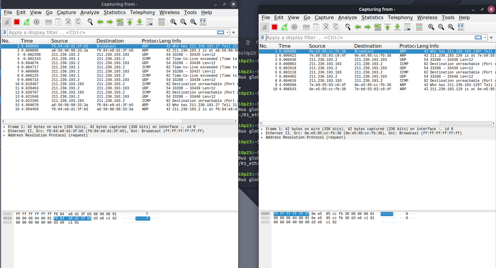
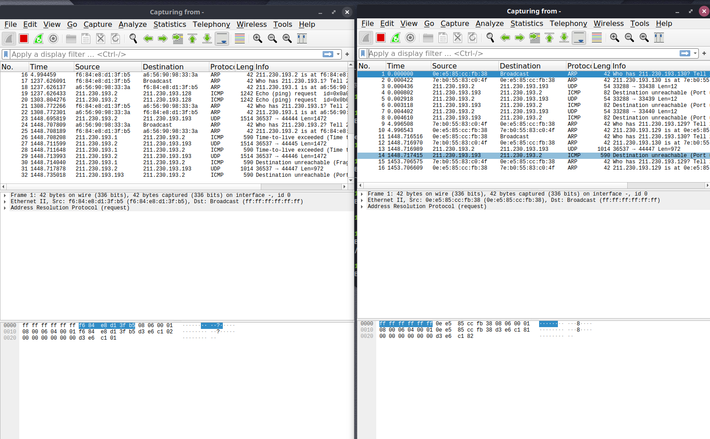

################# Rapport TP 3 RSX2 ##########################


**1 – ROUTAGE STATIQUE :**
--------------------------

1 - La commande ip route ne renvoie aucune table de routage pour les 3 routeurs car aucune route n'a été ajoutée.

  -  Les adresses des réseaux:
      - Adresse du réseau a: 211.130.193.0/26
      - Adresse du réseau A: 211.130.193.64/26  
      - Adresse du réseau b: 211.130.193.128/26
      - Adresse du réseau B: 211.130.193.192/26

  - Activer et configurer les interfaces des 3 routeurs
    - Routeur 1:
    ```
    ifconfig eth0 211.230.193.1/26
    ifconfig eth1 211.230.193.129/26
    ```
    - Routeur 2:
    ```
    ifconfig eth0 211.230.193.2/26
    ifconfig eth1 211.230.193.65/26
    ```
    - Routeur 3:
    ```
    ifconfig eth0 211.230.193.130/26
    ifconfig eth1 211.230.193.193/26
    ```
- En affichant les tables de routage à nouveau, celles-ci ne sont pas vides car les interfaces eth0 et eth1 de tous les routeurs ont été configurées.

- La premiere et la deuxième adresse indiquent respectivement  l'adresse du sous réseau affecté aux interfaces eth0 et l'adresse du sous réseau affecté aux interfaces eth1. Les routes indiquent également les adresses de chacune des interfaces.

2 - Ajout des routes:
```
ip route add 211.230.193.64/26 via 211.230.193.2
ip route add 211.230.193.192/26 via 211.230.193.130
ip route add 211.230.193.128/26 via 211.230.193.1
ip route add 211.230.193.192/26 via 211.230.193.1
ip route add 211.230.193.0/26 via 211.230.193.129
ip route add 211.230.193.64/26 via 211.230.193.129
```

**2 – TRACEROUTE:**
-------------------

1 - La commande `traceroute 211.230.193.193` affiche en général le chemin empreinté par le paquet ip envoyé depuis l'interface eth0 du R2 vers l'interface eth1 du R3. En particulier, la commande imprime des lignes contenant le TTL suivi de l'adresse de la passerelle suivi du temps de déclechement de chaque. La commande affiche aussi le nombre maximale du paramètre TTL(à 64).

2 - Le TTL des paquets IP qui trasportent ces segments UDP est de 1. Non les 3 premiers segments UDP ne parviennent pas jusqu'à R3. En effet, même si ces segments sont à destination de R3, ils s'arrêtent au niveau du routeur R1 à cause d'un `time to live exceeded`. le routeur R2 va essayer de renvoyer à nouveau un segment UDP(avec le même TTL(à 1) dans le paquet IP qui transporte ce segment ). Par défaut, R2 va répeter cette opération 3 fois(c'est la raison pour laquelle on voit 3 segements UDP et 3 réponses ICMP).

3 - le TTL des 3 paquets IP suivants reçu par R1 sont à 2. Oui, ces paquets parviennent jusqu'à R3. En effet, lorsque le routeur R2(qui va commencer cette fois-ci le TTL à 2) envoie le segment vers R3, le routeur R1 le reçoit en premier en essayant de décrémenter le TTL avant de le transmettre. Par conséquent, la valeur du TTL est à 1 et le routeur R1 transmet le segment vers R3. Ainsi, le segement arrive à sa destination et traceroute cesse de recevoir des TTL exceeded, et le routeur R2 recois un paquet ICMP réponse(Destination unreachable, car traceroute essaie de contacter volontairement un port invalide) provenant du R3.

4 - Traceroute envoie un message de type `who has ...125? Tell ...1` avec le protocole ARP à tous les routeurs.

**3 - TRACEPATH:**
------------------

1 -Pour configurer le MTU sur les interfaces de la liaison `b`, on lance sur:
- R1: `ip link set dev eth1 mtu 1000`
- R3: `ip link set dev eth0 mtu 1000`

2 - `ping -c1 -s 1200 -M dont 211.230.193.192`
- Cette commande renvoie :
    - le nombre de packet transmit(en l'occurence, 1 paquet),
    - le nombre de packet reçu (en l'occurence, 0 packet reçu),
    - le pourcentage des données perdus(en l'occurence 100%).
- Non, la requête ne parvient pas jusqu'à B, elle est perdue mais on remarque sur la capture de trame que les données ont été fragmenté.

3 - `ping -c1 -s 1200 211.230.193.192`
- Non la requête ne parvient pas à destination, elle s'arrête au niveau du routeur R1. Ce dernier renvoie à R2 un message ICMP indiquant que la destination est inaccessible et que la fragmentation des données est necessaire. Ainsi en regardant le paquet IP contenu dans la requête, on trouve que le flag `don't fragment` est mis à 1(activé). Ce qui explique que R1 n'a pas pu transmettre la requête au réseau `B`.

4 - `tracepath 211.230.193.193`
- La 1ère colonne montre le TTL du paquet IP envoyé aux routeurs destinations (R1, R3).
- La 2ème colonne montre l'adresse du routeur qui a répondu aux segments udp.
- La 3ème colonne montre le temps émet entre deux envoie de 2 sondes.
- La 4ème colonne affiche le PTMU à chaque fois qu'il change
- La dernière ligne résume toutes les infos sur tous les chemins vers R3:
    - Il montre le MTU du chemin detecté et le TTL.

- On tape la commande dans R1 et R3 : `ping -c1 -s -M dont 1200 211.230.193.128` 

**4 - RIP:**
------------

- On supprime les routes à l'aide de la commande : `ip route del addressIP`

1 - L'adresse de destination des annonce RIP est 224.0.0.9. Les annonces sont envoyées chaque 30 secondes.

2 - Le routeur R2 communique à R1 les adresses réseaux qu'il connaît et envoie le résultat de calcul de la distance(métrique en nombre de sauts) sur ces adresses.

3 - La métrique associée au réseau A dans les annonces de R2 est de 1, puisqu'il faut au moins traverser ce routeur5R2) pour atteindre le réseau A.
  - La métrique associée au réseau A dans les annonces de R1 est de 2, puisqu'il faut traverser R1 puis R2.
  - La métrique associée au réseau A dans les annonces de R3 sera de 3, puisqu'il faut traverser R3 puis R1 puis R2

4 - Oui les tables de routages confirment ma réponse précédente.
Si on ajoute un lien directe entre R2 et R3, la métrique associée au réseau A sur R3 sera de 2. En effet l'annonce aura besoin de traverser le routeur R3 puis R2.

**Quelques captures:**
----------------------




